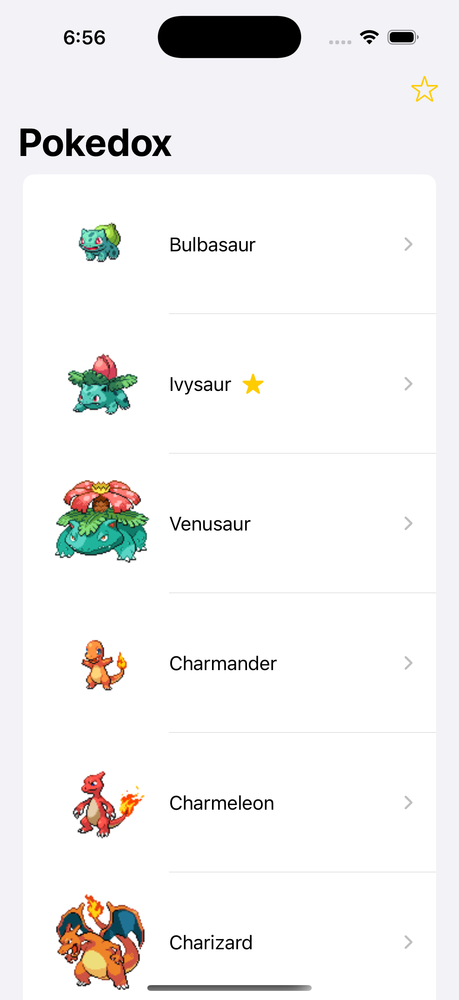
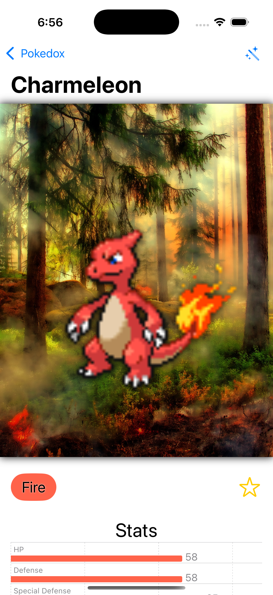
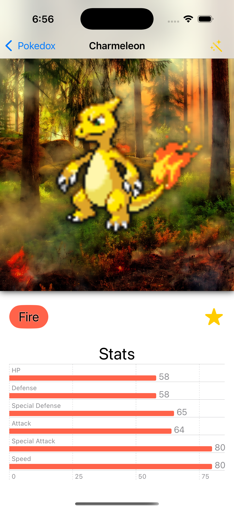
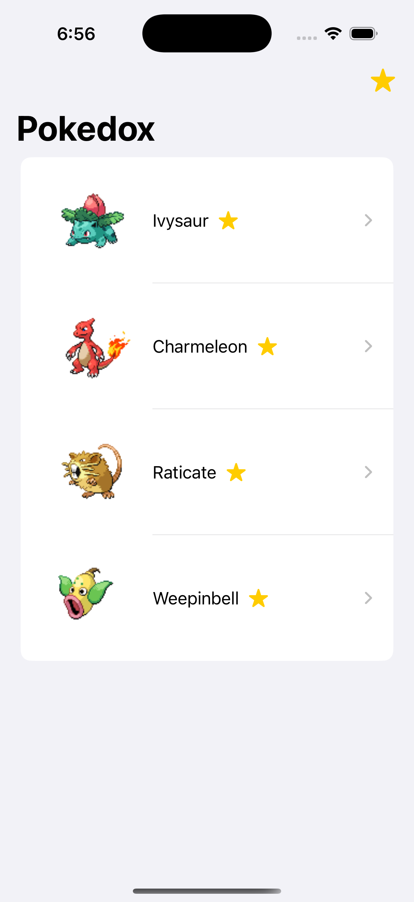
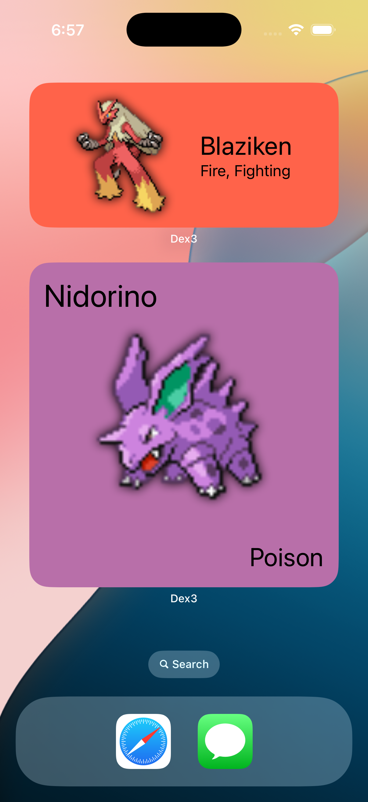

# Dex3 - Pokémon Dex App

Dex3 is a lightweight iOS app showcasing Pokémon characters from the 1st, 2nd, and 3rd generations. Built with SwiftUI and Core Data, Dex3 lets users explore detailed information about their favorite Pokémon.

## Table of Contents
1. [Features](#features)
2. [Demo](#demo)
3. [Requirements](#requirements)
4. [Installation](#installation)
5.  [Architecture](#architecture) 


## Features
- Displays Pokémon from Generations 1–3 with high-quality sprites.
- View detailed stats including HP, Attack, Defense, Special Attack, Special Defense, and Speed.
- Favorite your top Pokémon for quick access.
- Animated sorting and fetching for a polished user experience.
- Offline persistence with Core Data.

## Demo







## Requirements
- Xcode 14.0 or later
- iOS 16.0 or later
- Swift 6

  ## Installation

1. Clone the repo:
   ```bash
   git clone https://github.com/fathima-nasmin/Dex3.git

   cd Dex3  
   open Dex3.xcodeproj

2. Build and run the app on a simulator or connected device.

## Architecture
Dex3 uses an MVVM (Model-View-ViewModel) architecture and follows SwiftUI principles.

- Model: Core Data entities for persistent Pokémon storage.
- View: SwiftUI views displaying Pokémon lists and details with animations.
- ViewModel: Bridges between Core Data and the UI with @Published properties.

## Key tools and Framework

- SwiftUI: For UI and declarative views.
- Core Data: For offline persistence.
- Combine: To handle async data flow.
- FetchController: Custom API controller to fetch Pokémon details.
